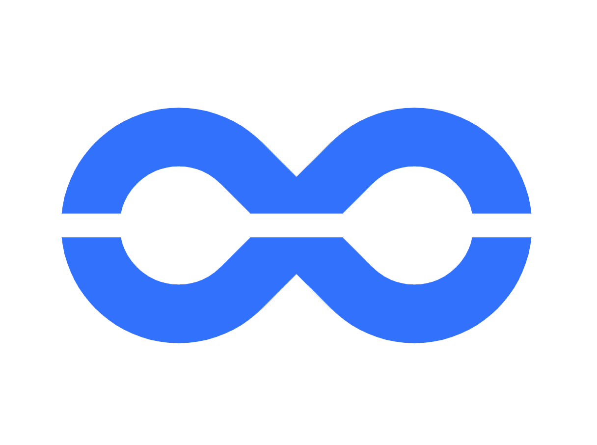
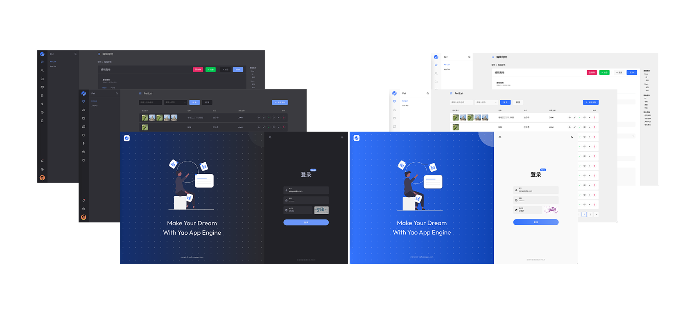
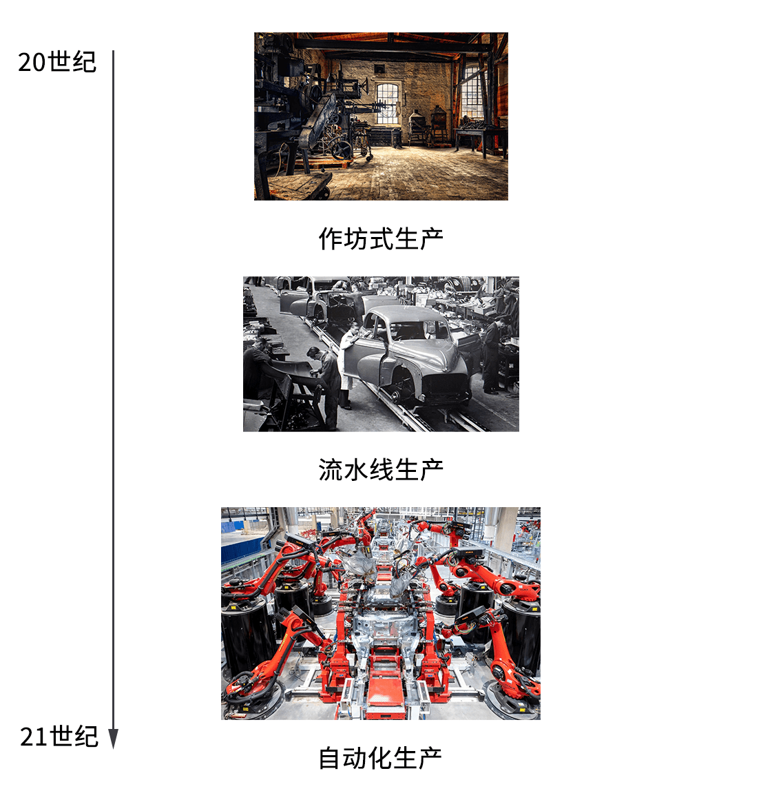

      

# 
XGen

_
A **official** lowcode resolution based yao app engine.
_

  
  
  
  
  
    

## What`s XGen

As it`s name, XGen is a **official** lowcode resolution based yao app engine. It provides multiple lowcode components, just like Table, Form, Chart, Dashboard, List, and kinds of embedded lowcode components for extend above base components.

You just need writing json to use those components, enjoy it!

https://github.com/YaoApp/xgen/tree/main/packages/xgen/components

List of components:

- base 
  - Table
  - Form
  - List
  - Chart
  - Dashboard
  - Modal

- view 
  - A
  - Checkbox
  - Color
  - Image
  - Switch
  - Tag
  - Text
  - Tooltip

- edit
  - Cascader
  - CheckboxGroup
  - ColorPicker
  - DatePicker
  - Input
  - InputNumber
  - List
  - Mentions
  - Password
  - RadioGroup
  - RangePicker
  - RichText
  - Select
  - TextArea
  - TimePicker
  - Tree
  - Upload

- chart
  - Bar
  - Funnel
  - Line
  - LineBar
  - Number
  - NumberChart
  - Pie

- group
  - Block

- optional
  - Table
    - Batch
    - Import

## Motivation

## Tips

Before you run dev, you must generate theme css files to public by `pnpm run build:theme`.

## Todos

### Foundation

- [x] Build scaffolding based on umi 4
- [x] Use Turborepo + Parcel
- [x] template conversion rule design
- [x] EIC Architecture Design
- [x] Migration and rebuilding of style files
- [x] Support Light Theme
- [x] Multilingual support
- [x] Design error capture based on EventListner
- [x] Table rebuilding
- [x] Form rebuilding
- [x] Design of extension components based on React/Vue/Lit Element
- [ ] JSON field prompt vscode json.$schema

### Gifts

- [ ] Component packaging tool xtool
- [ ] Support custom components, import packaged components from based on Dynamic import

### Ideas

- [ ] Cloud components, support importing components from yao workshop
- [ ] Infra, a visual work platform, supports one-click deployment of YaoApp
- [ ] Component as proto (CAP), components are prototypes, CAP prototyping platform, prototyping tools designed from the code level (thinking some inspiration for reverse workflow), product planning uses the component system provided by developers to make prototypes, and the production is completed After that, the designer adjusts the component parameters, adds CSS for processing, and delivers the code to the developer.
